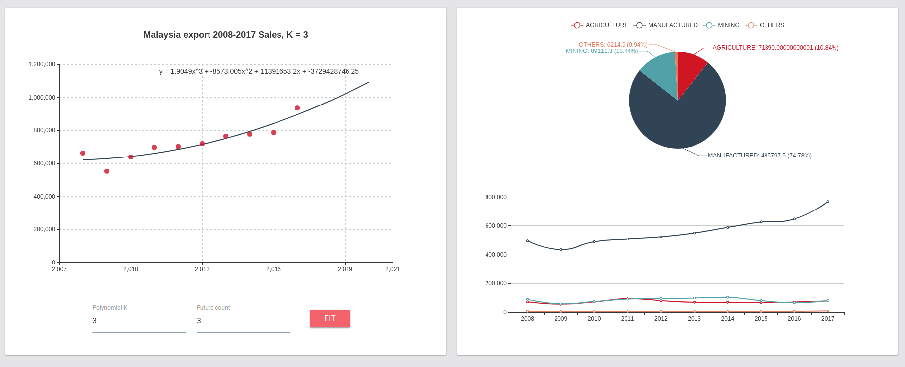
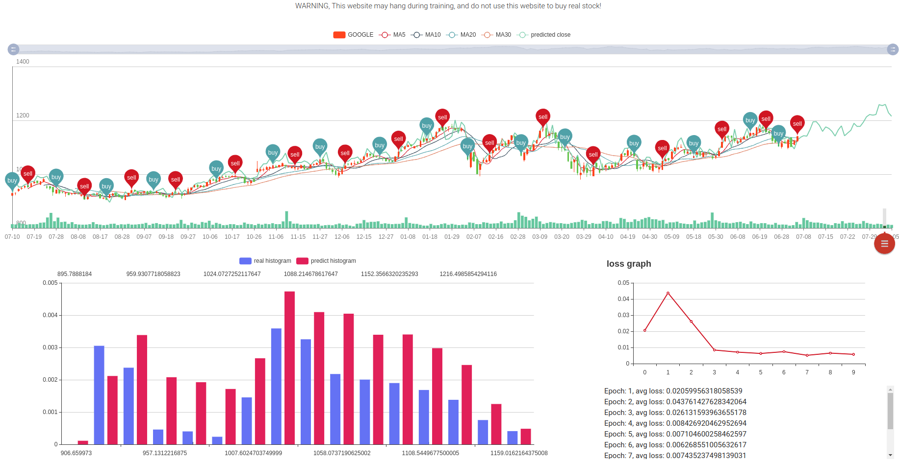
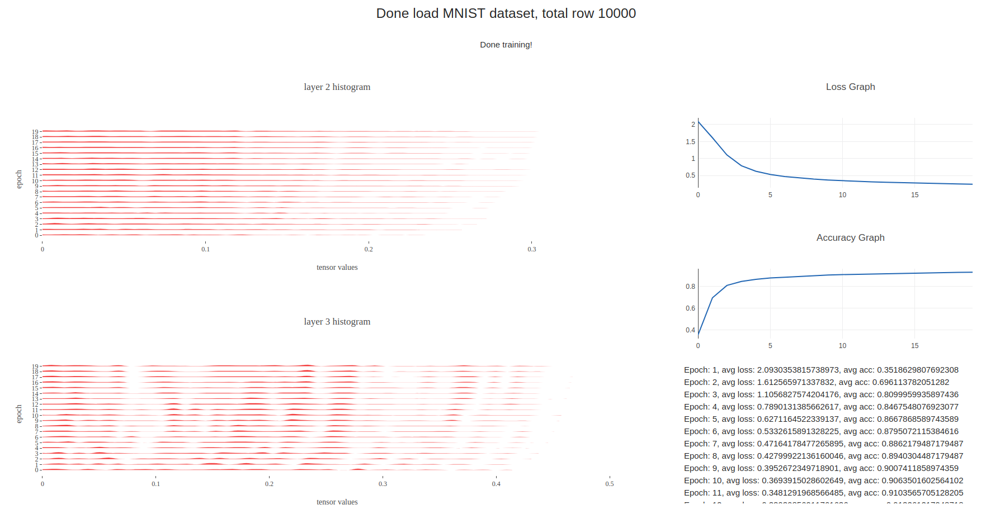
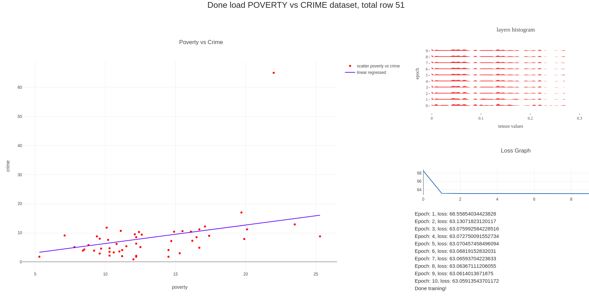
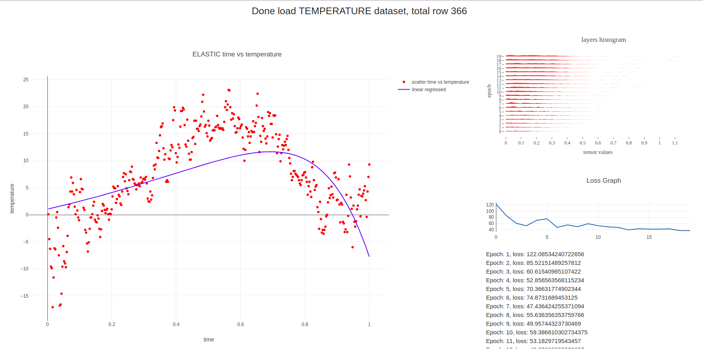

# Tensorflow-JS-Projects
Web projects using Tensorflow JS, Plotly, D3, Echarts, NumJS, and NumericJS

## Completed models
1. Tensorboard-like histogram visualization on MNIST
2. Decision boundaries for IRIS using PCA and SVD
3. Linear, Polynomial, Ridge, Lasso and Elasticnet Regression
4. Stock forecasting and investment simulation with distribution study
5. Malaysia Export products forecasting

## Incoming models
1. Realtime sentiment analysis
2. Realtime char generator

## How to run
1. Just click any .html and wait the output, thats all!

## Output

#### Malaysia Export products forecasting


#### Stock forecasting


#### MNIST with layers histogram, mnist/feed-forward-mnist-histogram.html


#### IRIS with PCA decision boundaries, mnist/pca.html


#### linear regression, regression/linear-regression.html


#### elasticnet regression, regression/elastic-regression.html


#### Feed-forward on MNIST, mnist/feed-forward-mnist.html
```text
Done load MNIST dataset, total row 10000
Epoch: 1, avg loss: 1.8914892367827587, avg acc: 0.5321514423076923
Epoch: 2, avg loss: 1.0076198738354902, avg acc: 0.8060897435897436
Epoch: 3, avg loss: 0.5955630428133867, avg acc: 0.8642828525641025
Epoch: 4, avg loss: 0.4525927151433932, avg acc: 0.8887219551282052
Epoch: 5, avg loss: 0.3820862218928643, avg acc: 0.9001402243589743
Epoch: 6, avg loss: 0.338365969606317, avg acc: 0.9095552884615384
Epoch: 7, avg loss: 0.3073786131751079, avg acc: 0.9163661858974359
Epoch: 8, avg loss: 0.2836516798975376, avg acc: 0.9223758012820513
Epoch: 9, avg loss: 0.2643589421342581, avg acc: 0.9267828525641025
Epoch: 10, avg loss: 0.2480414705350995, avg acc: 0.932792467948718
Done training!
```

#### Conv2D on MNIST, mnist/conv-mnist.html
```text
Done load MNIST dataset, total row 10000
Epoch: 1, avg loss: 2.2892294388550978, avg acc: 0.1833934294871795
Epoch: 2, avg loss: 2.228218048046797, avg acc: 0.4563301282051282
Epoch: 3, avg loss: 2.053275716610444, avg acc: 0.563301282051282
Epoch: 4, avg loss: 1.6820037135711083, avg acc: 0.6386217948717948
Epoch: 5, avg loss: 1.2453415164580712, avg acc: 0.7159455128205128
Epoch: 6, avg loss: 0.9533616136281918, avg acc: 0.7562099358974359
Epoch: 7, avg loss: 0.7915175690864905, avg acc: 0.7830528846153846
Epoch: 8, avg loss: 0.693353934929921, avg acc: 0.803886217948718
Epoch: 9, avg loss: 0.6254916565540509, avg acc: 0.8218149038461539
Epoch: 10, avg loss: 0.5740557246101208, avg acc: 0.8349358974358975
Done training!
```

#### RNN LSTM on MNIST, mnist/rnn-lstm-mnist.html
```text
Done load MNIST dataset, total row 10000
Epoch: 1, avg loss: 1.939207171782469, avg acc: 0.32081330128205127
Epoch: 2, avg loss: 1.1817189363332896, avg acc: 0.5842347756410257
Epoch: 3, avg loss: 0.7812266132006278, avg acc: 0.7482972756410257
Epoch: 4, avg loss: 0.5921771041093729, avg acc: 0.8126001602564102
Epoch: 5, avg loss: 0.4583902078179213, avg acc: 0.859375
Epoch: 6, avg loss: 0.36646934713308627, avg acc: 0.8894230769230769
Epoch: 7, avg loss: 0.30778571504812974, avg acc: 0.9084535256410257
Epoch: 8, avg loss: 0.26533992569416, avg acc: 0.9195713141025641
Epoch: 9, avg loss: 0.24064976473649344, avg acc: 0.9273838141025641
Epoch: 10, avg loss: 0.20142345815801468, avg acc: 0.9407051282051282
Done training!
```

## Dataset used, data/
1. MNIST
2. Iris
3. [Bahasa Sentiment](https://www.kaggle.com/huseinzol05/news-sentiment-in-bahasa)
4. Stock market
5. Dummy multivariate dataset
